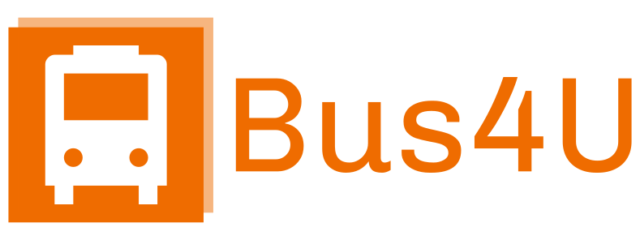

<!-- PROJECT LOGO -->
 

  

 
  

    Never miss your ride!
     
    <a href="https://github.com/zsigmondattila/bus4u/tree/main/docs"><strong>Explore the docs »</strong></a>
     
     
    <a href="https://bus4u.netlify.app">View live preview</a>
    ·
    <a href="https://github.com/zsigmondattila/bus4u/issues">Report Bug</a>
    ·
    <a href="https://github.com/zsigmondattila/bus4u/issues">Request Feature</a>
  

<!-- TABLE OF CONTENTS -->

  
Table of Contents

  <ol>
    <li>
      <a href="#about-the-project">About The Project</a>
      <ul>
        <li><a href="#built-with">Built With</a></li>
      </ul>
    </li>
    <li>
      <a href="#getting-started">Getting Started</a>
      <ul>
        <li><a href="#prerequisites">Prerequisites</a></li>
        <li><a href="#installation">Installation</a></li>
      </ul>
    </li>
    <li><a href="#usage">Usage</a></li>
    <li><a href="#contact">Contact</a></li>
    <li><a href="#acknowledgments">Acknowledgments</a></li>
  </ol>

<!-- ABOUT THE PROJECT -->
## About The Project

One of the most environmentally friendly ways to travel is to choose public transport. The more people choose this form of travel, the cleaner environment we can live in, and the less congested the roads would be. Unfortunately, the choice of public transport also comes with many disadvantages.
* From the point of view of passengers, it is relatively difficult to choose the right bus for us, because it is not easy to find the timetables of the different companies anywhere. Even if we find this, there is still the possibility that the buses will be late, or worse, leave earlier.
* From the point of view of companies, it is often not easy to monitor the condition of the buses, the costs, and to keep track of the profit.

By creating the application, we offer solutions to all these problems.

(<a href="#readme-top">back to top</a>)

### Built With

Our API is based on Ruby on Rails, which is installed on an Azure virtual machine. The websites for both users and companies were created in the Vue.js framework, and the application was written in Flutter. The former are deployed using netlify.

* [![Ruby][Ruby]][Ruby-url]
* [![Vue][Vue.js]][Vue-url]
* [![Flutter][Flutter]][Flutter-url]

* [![Azure][Azure]][Azure-url]
* [![Netlify][Netlify]][Netlify-url]

(<a href="#readme-top">back to top</a>)

<!-- USAGE EXAMPLES -->
## Usage

_For more examples, please refer to the [Documentation](https://github.com/zsigmondattila/bus4u/tree/main/docs)_

(<a href="#readme-top">back to top</a>)

<!-- LICENSE -->
## License

Distributed under the MIT License. See `LICENSE.txt` for more information.

(<a href="#readme-top">back to top</a>)

<!-- CONTACT -->
## Contact

Bodó Bálint - [@zsigmond.attila1](https://www.facebook.com/zsigmond.attila1) - zsigmond.attila@student.ms.sapientia.ro

Portik Szabolcs - [@portik.szabolcs.94](https://www.facebook.com/portik.szabolcs.94) - portik.szabolcs@student.ms.sapientia.ro

Zsigmond Attila - [@balint.bodo.98](https://www.facebook.com/balint.bodo.98) - bodo.balint@student.ms.sapientia.ro

Project Link: [https://github.com/zsigmondattila/bus4u](https://github.com/zsigmondattila/bus4u)

(<a href="#readme-top">back to top</a>)

<!-- ACKNOWLEDGMENTS -->
## Acknowledgments

Use this space to list resources you find helpful and would like to give credit to. I've included a few of my favorites to kick things off!

* [Devise token auth](https://devise-token-auth.gitbook.io/devise-token-auth/)
* [PostreSQL](https://www.postgresql.org/)
* [Puma web server](https://puma.io/)
* [Stripe](https://stripe.com/en-ro)

(<a href="#readme-top">back to top</a>)

<!-- MARKDOWN LINKS & IMAGES -->
<!-- https://www.markdownguide.org/basic-syntax/#reference-style-links -->
[Vue.js]: https://img.shields.io/badge/Vue.js-35495E?style=for-the-badge&logo=vuedotjs&logoColor=4FC08D
[Vue-url]: https://vuejs.org/
[Ruby]: https://img.shields.io/badge/Ruby_on_Rails-CC0000?style=for-the-badge&logo=ruby-on-rails&logoColor=white
[Ruby-url]: https://rubyonrails.org
[Flutter]: https://img.shields.io/badge/Flutter-02569B?style=for-the-badge&logo=flutter&logoColor=white
[Flutter-url]: https://flutter.dev
[Postgres]: https://img.shields.io/badge/PostgreSQL-316192?style=for-the-badge&logo=postgresql&logoColor=white
[Postgres-url]: https://postgresql.org
[Netlify]:https://img.shields.io/badge/Netlify-00C7B7?style=for-the-badge&logo=netlify&logoColor=white
[Netlify-url]: https://netlify.com
[Azure]: https://img.shields.io/badge/Microsoft_Azure-0089D6?style=for-the-badge&logo=microsoft-azure&logoColor=white
[Azure-url]:https://azure.microsoft.com